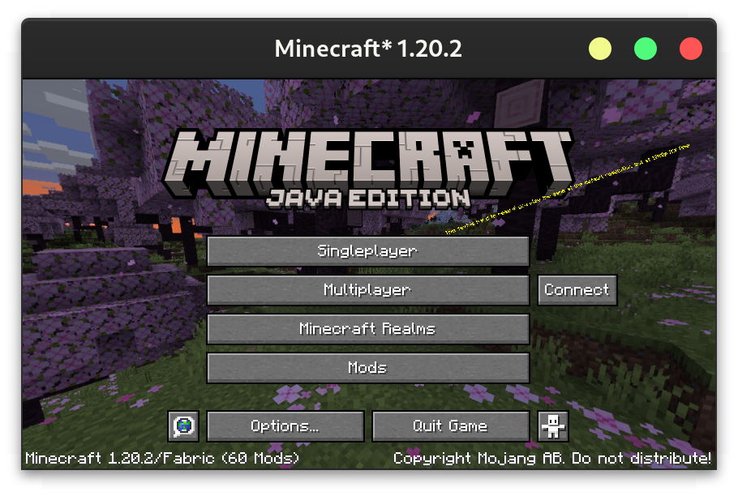
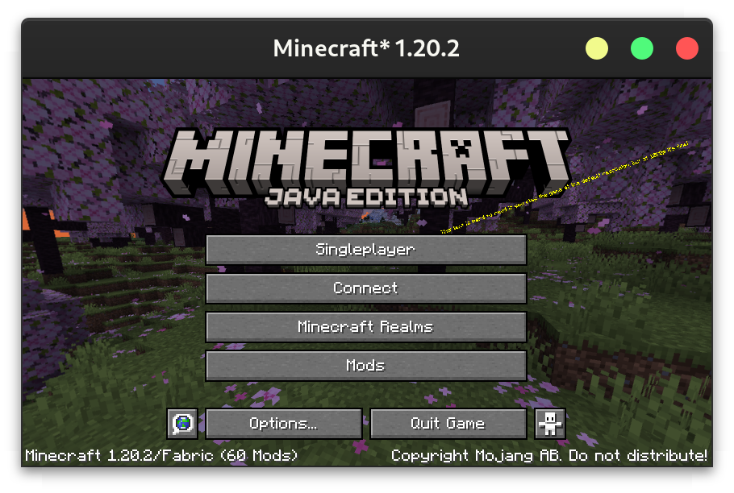

# Quicker Connect Button

<center>
    
    
    
</center>

Adds a connect button to the main menu for quickly connecting to servers.

<center>





</center>

## Configuration

The config can either be changed through a GUI (using Mod Menu on Fabric or the config button on Forge), or directly at `config/quickerconnectbutton.json5`. The GUI contains tooltips explaining each option.

```json5
{
  /* Leave empty to disable the quick connect button
     - default: \"\"
  */
  ip: "localhost",
  /* - default: 25565
     - must be between 0.0 and 65535.0
  */
  port: 25565,
  /* Whether to replace the default multiplayer button on the main menu, or add a new one to its right.
     - default: false
  */
  replaceMultiplayerButton: true,
  /* The text to display on the button. Leave empty to use "Connect".
     - default: \"\"
  */
  text: "Connect to an Awesome Server",
  /* What to do if the server has a resource pack.
     - default: PROMPT
     - must be one of: ENABLED, DISABLED, PROMPT
  */
  resourcePackBehaviour: "ENABLED"
}
```

<center><a href="https://bisecthosting.com/jamalam"></a></center>
